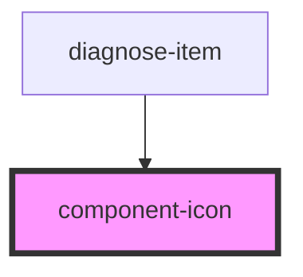

# component-icon

<!-- Auto Generated Below -->

## Properties

| Property         | Attribute         | Description | Type     | Default     |
| ---------------- | ----------------- | ----------- | -------- | ----------- |
| `responseStatus` | `response-status` |             | `number` | `undefined` |

## Dependencies

### Used by

 - [diagnose-item](../item)

### Graph

----------------------------------------------

*Built with [StencilJS](https://stenciljs.com/)*
