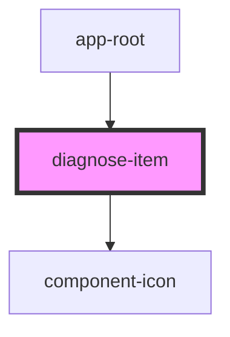

# diagnose-item

<!-- Auto Generated Below -->

## Properties

| Property   | Attribute  | Description | Type       | Default     |
| ---------- | ---------- | ----------- | ---------- | ----------- |
| `checkbox` | `checkbox` |             | `string`   | `undefined` |
| `fileId`   | `file-id`  |             | `string`   | `undefined` |
| `headers`  | `headers`  |             | `any`      | `undefined` |
| `method`   | `method`   |             | `string`   | `undefined` |
| `response` | --         |             | `Response` | `undefined` |
| `url`      | `url`      |             | `string`   | `undefined` |

## Events

| Event         | Description | Type                     |
| ------------- | ----------- | ------------------------ |
| `formChanged` |             | `CustomEvent<FormEvent>` |

## Dependencies

### Used by

 - [app-root](../root)

### Depends on

- [component-icon](../icon)

### Graph

----------------------------------------------

*Built with [StencilJS](https://stenciljs.com/)*
