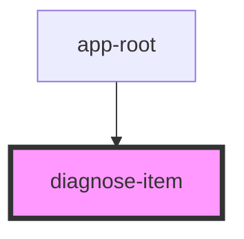

# diagnose-item

<!-- Auto Generated Below -->

## Dependencies

### Used by

 - [app-root](../root)

### Graph

----------------------------------------------

*Built with [StencilJS](https://stenciljs.com/)*
