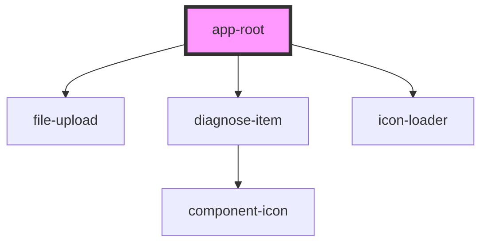

# app-root

<!-- Auto Generated Below -->

## Dependencies

### Depends on

- [file-upload](../upload)
- [diagnose-item](../item)
- [icon-loader](../loader)

### Graph

----------------------------------------------

*Built with [StencilJS](https://stenciljs.com/)*
