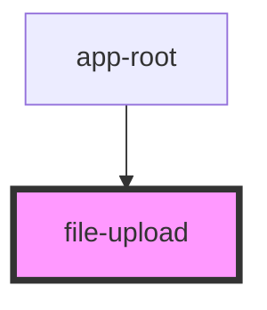

# file-upload

<!-- Auto Generated Below -->

## Events

| Event                | Description | Type                                 |
| -------------------- | ----------- | ------------------------------------ |
| `upoadCompleteEvent` |             | `CustomEvent<ArrayBuffer \| string>` |

## Dependencies

### Used by

 - [app-root](../root)

### Graph

----------------------------------------------

*Built with [StencilJS](https://stenciljs.com/)*
